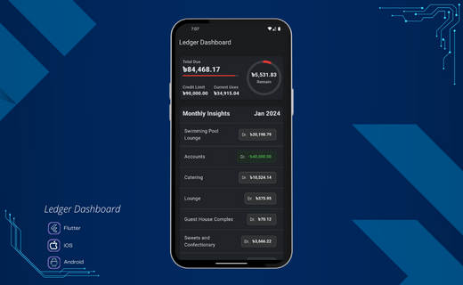
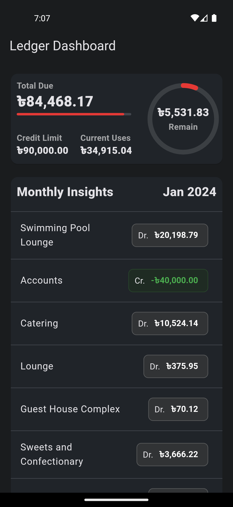

<div align="center">
    <h1>Individual User Ledger Dashboard</h1>
    
    <h2>This Flutter project builds a personalized and visually appealing ledger dashboard for individual users to track and manage their finances effectively.
    </h2>
</div>

### Screenshots

<div align="center">
    <div>
        
        <p>Figure: Dashboard</p>
    </div>
</div>

### How to format this code?

- if our code is not formatted then run following command in our terminal to format code
  ```
  dart format .
  ```


### Libraries and tools used

- [flutter_hooks](https://pub.dev/packages/flutter_hooks): Manage the life-cycle of a Widget
- [intl](https://pub.dev/packages/intl): For date and number formatting
- [BLoC](https://bloclibrary.dev) - State management
- [equatable](https://pub.dev/packages/equatable): Simplify Equality Comparisons
- [get_it](https://pub.dev/packages/get_it): Service Locator
- [retrofit](https://pub.dev/packages/retrofit): For dio client generator
- [dio](https://pub.dev/packages/dio): - To making HTTP requests


## Authors

- [@shahiduldeowan](https://www.linkedin.com/in/shahiduldeowan/)
